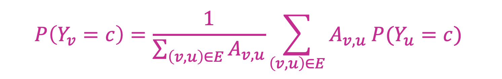

# GCN-lab Stanford CS224W Fall 2021 
- ## [Learn the Open Course](http://web.stanford.edu/class/cs224w/)  

- ## [Video on Bilibili CS224W Winter 2021](https://www.bilibili.com/video/BV1Xr4y1q788?spm_id_from=333.337.search-card.all.click&vd_source=b4c6848f0ca53aaf723f77170427ce41)  


- ## [Coding Reference](https://gitcode.net/mirrors/PolarisRisingWar/cs224w-2021-winter-colab?utm_source=csdn_github_accelerator)
- ## [Review Reference](https://wwwjn.github.io/blog/posts/15af85cd) and [A project from this author: Analyzed on arXiv Citation Dataset](https://wwwjn.github.io/blog/posts/5ee0fbe5) 学习结束检验漏洞
- ## [Requirements: Blog Posts](https://github.com/CS224w-KOR/blog) and [with Jupyter](https://github.com/fastai/fastpages#writing-blog-posts-with-jupyter)
---


# Checklist:  
| Slides  |  Description | Colab  |
| ----------- | ----------- | ----------- |
| [lecture 1](http://web.stanford.edu/class/cs224w/slides/01-intro.pdf) | just Introduction |  |
| [lecture 2](http://web.stanford.edu/class/cs224w/slides/02-tradition-ml.pdf) | about Features | Colab-1  <font style="color: rgb(250,250,0)">Point: Q7 **Shallow Encoder**  |
| [lecture 3](http://web.stanford.edu/class/cs224w/slides/03-nodeemb.pdf) | |  |
| [lecture 4](http://web.stanford.edu/class/cs224w/slides/04-pagerank.pdf) | about PageRank and Matrix Factoriztion |  |
| [lecture 5](http://web.stanford.edu/class/cs224w/slides/05-message.pdf) | About Semi-supervised Node Classification |  |
| [lecture 6](http://web.stanford.edu/class/cs224w/slides/06-GNN1.pdf)| about GNN | Colab-2 (NEED GPU) |
| [lecture 7](http://web.stanford.edu/class/cs224w/slides/07-GNN2.pdf)| about GNN-2 |  | 
| [lecture 8](http://web.stanford.edu/class/cs224w/slides/08-GNN-application.pdf)| about GNN Graph Augmentation | |
| [lecture 9](http://web.stanford.edu/class/cs224w/slides/09-theory.pdf)| about GNN Expression (GIN), AGG |  | 
| [lecture 10](http://web.stanford.edu/class/cs224w/slides/09-theory.pdf)| about Heterogeneous Graph and Knowledge Graph | Colab-3 GraphSAGE <font style="color: rgb(250,250,0)">Understand **x=**(x_i, x_j) in propagate|
| [lecture 11](http://web.stanford.edu/class/cs224w/slides/11-reasoning.pdf)| about Knowledge Graph Queries |  |
| [lecture 12](http://web.stanford.edu/class/cs224w/slides/12-motifs.pdf)| about Subgraph and Motifs |  |
| [lecture 13](http://web.stanford.edu/class/cs224w/slides/13-recsys.pdf)| about Recommendation Systems | Colab-4 GAT |
| [lecture 14](http://web.stanford.edu/class/cs224w/slides/14-communities.pdf)| about Community Network | |
| [lecture 14-2](http://snap.stanford.edu/class/cs224w-2020/slides/14-traditional-generation.pdf)| in CS224W Winter 2021 | |

<br><br>

---

# About Features (in lecture 2)

- ## Node-level feature: (Structures and Position)
  - ### Node degree (importance features and structure-based feature)
  - ### Node Centrality (importance features)
    - #### Engienvector Centrality
    - #### Betweenness Centrality
    - #### Closeness Centrality ...
  - ### Clustering Coefficient (structure-based feature)
  - ### Graphlets GDV (structure-based feature) 


- ## Link-level feature:
  node level features miss information of the relationship of nodes
  - ### Distance-based feature
  - ### Local neighborhood overlap
    - #### Common neighbors
    - #### Jaccard's coefficient (normalize by degree) 
    - #### Adamic-Adar index (ordinary neighbors)
  - ### Global neighborhood overlap
    - #### Katz index (number of paths)
  
- ## Graph-level Kernels: (similarity between graphs) 
    > <font style="color: rgb(250,250,0)">Design graph feature vector</font>
  - #### Graphlet Kernel (bag-of-graphlets representation)
  - #### Weisfeiler-Lehman Kernel (bag-of-node-degrees representation)
    Color Refinement & Hash aggregated colors
  - #### Random-walk Kernel
  - #### Shortest-path graph Kernel ...

<br><br>

---

# About GNN Outputs


<br><br><br>

---

# About Embedding, Representation Learning
> Learn the embedding is unsupervised
### Random Walk

  
  <br><br><br><br>  
  Most likely be the neighbor (should be because of their cos similarity) 
  <br>
  <br>

  

  <br><br>
  <br>

  - ### DeepWalk
  - ### Node2Vec
  - ### biased random walk based on attributes, learnd weights
  - ### To embed the nodes.
    - Embed nodes and **sum/average** them
    - Super-node spans (sub)graph, then embed that node
    - Anonymous Walk Embeddings(times each anonymous walk happens or concatenate anonymous walks embeddings)

### Matrix Factorization
Relevant to Node Similarity. Node Embedding can be expressed as MF.  

- ENCODER: 

- DEEPWALK:


<br><br><br>

---

# About Message Passing and Collective Classification 
> Classification relates to feature, neighbors' labels and features.  
## Leverage correlation, Homophily and Influence, to predict labels
<br>  

## Collective Classification 3 steps:
1. ### Local classifier assign initial labels.
2. ### Relational classifier capture correlations between nodes.
3. ### Collective Inference propagate correlations through network.

<br>

## 3 Techniques:
- ### Relational Classification

  

- ### Iterative Classification

  - Classifier A & B (<font style="color: rgb(250,250,0)">How to Update</font>)

- ### Loopy Belief Propagation
  Tell neighbors what you think they are.

## Correct and Smooth (C&S) to Post-Process
- Base Predictor causes bias, errors.

- Correct Step: Errors Diffusion.   
  
- Soft Label to Ground Truth Hard Label.
- Smooth Step: Labels Diffusion. 
     
- [About Normalized diffusion matrix.](https://mlg.eng.cam.ac.uk/zoubin/papers/zgl.pdf)


<br><br>


# From Lecture 6, GCN coming Permutation invariant
> CNN can be seen as a special GNN with fixed neighbor size and ordering and Transformer layer can be seen as a special GNN that runs on a fullyconnected “word” graph!
## Basic, Average neighbors 


<br><br>  <br><br>
<br><br>
<br><br>

<br><br>

- AGG, LOSS, TRAIN A SET, GENERATE AS NEEDED
- same parameters shared by all nodes
- GNN Layer = Message + Aggregation
- GCN and GraphSAGE (2-stage AGG and l2 Normalization to get same scales) and GAT (Attention weights and Multi-head Attention to converge)

## GNN layer could consist of: (in Lecture 7)
```python
-> Linear -> BatchNorm -> Dropout -> Activation -> Attention -> Aggregation ->  
|       Stabilize training                     Control Message |
|                  Prevent Overfitting                         |
\________________________ Transformation ______________________/
```
- ### Graph Design: [GraphGym](https://github.com/snap-stanford/GraphGym) and [Simple Introduction](https://swarma.org/?p=25051)
- ### For Training Pipeline, GraphGym and [DeepSNAP](https://github.com/snap-stanford/deepsnap) and [Simple Introduction](https://snap.stanford.edu/deepsnap/notes/introduction.html)

<br><br><br>


# Graph Augmentation : feature & structure
1. ### Feature Augmentation: Constant (Node degree, Clustering coef, Centrality...) and one-hot IDs 
2. ### Structure Augmentation : Add Virtual N/E, Sampling ... 

# in Lecture 10 and 11

- ## Heterogeneous Graph G = (V, E, R, T) 

  Heterogenous graph : RGNN (Relational GNN)

- ## Knowledge Graphs (entities, types, relationships)

  1. <font size=4>TransE</font> : $f = - || h + r - t ||$  
  (any relation in the same embedding space)
  2. <font size=4>TransR</font>: Entity Space $R^d$ and Relation Space $R^k$ and Projection Metrix M belongs to $R^{k*d}$   and $f = - || M_r * h + r - M_r * t ||$  
  (in relation-specific space) 
  3. <font size=4>Bilinear DistMult</font> : $f_r(h, t) = < h, r, t>$   Cosine Similarity between h*r and t
  4. <font size=4>ComplEx</font> : $f_r(h, t) = Re< h, r, \overline{t}>$
  <br><br>
  ### Answer Predictive Queries :  $f_q(t) = - || q - t ||$ 
  ### Query2Box : 
  - Projection Operator `Box x Relation -> Box`
    - $Cen (q') = Cen (q) + Cen (r)$  
      $Off (q') = Off (q) + Off (r)$
  - Geometric Intersection Operator `Box x Box ... -> Box`  
    - $Cen(q_{inter}) = \sum_{i} w_i  \odot Cen(q_i)$  
    - $Off(q_{inter}) = min(Off(q_1), ..., Off(q_n)) \odot \sigma(f_{off}(Off(q_1), ..., Off(q_n)))$


<br><br><br><br>

# in Lecture 12
1. ## Random graphs in null model evaluating motif significance via Z-score $Z_i = \frac{(N_i^{real} - \overline{N}_i^{rand})}{std(N_i^{rand})}$
2. ## Subgraph Matching: in Order Embedding Space  
   Minimize $\sum_{i=1}^D(max(0, z_q[i]-z_t[i]))^2$

# in Lecture 13
1. ## Evaluation Matric $Recall@_K = \frac{|P_u \cap R_u|}{|P_u|}$

2. ## Surrogate losses are differentiable:
   - ### Binary loss: 
     ### $- \frac{1}{|E|}\sum{log(\sigma[f_\theta(u, v)])}-\frac{1}{|E_{neg}|}\sum{log(1-\sigma[f_\theta(u, v)])}$ (which unnecessarily penalize model) 
   - ### Bayesian Personalized Ranking (BPR) loss:
     ### $\frac{1}{|U|}\sum_{u^* } \{\frac{1}{|E| |E_{neg}|} \sum_{(u^* , v_{pos})} \sum_{(u^* , v_{neg})} -log(\sigma[f_\theta(u^* , V_{pos})-f_\theta(u^* , V_{neg})])\}$
   
3. ## Function $f_{\theta}$：
   - ### § Neural Graph Collaborative Filtering (NGCF)
     (matrix factorization)

     
   
     $score(u, v) = h_u^{(K) T} h_v^{(K)}$
   - ### § LightGCN
     uses the diffused user/item embeddings <font style="color: rgb(250,250,0)"> Recall, C&S diffusion</font>

   - ### PinSAGE (Pin Embedding)
     negative sampling strategies: increasing hard negatives (finer-grained predictions)


   <br>

Last, GCN: https://docs.dgl.ai/tutorials/models/1_gnn/1_gcn.html